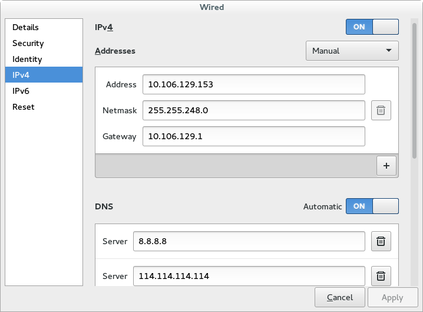
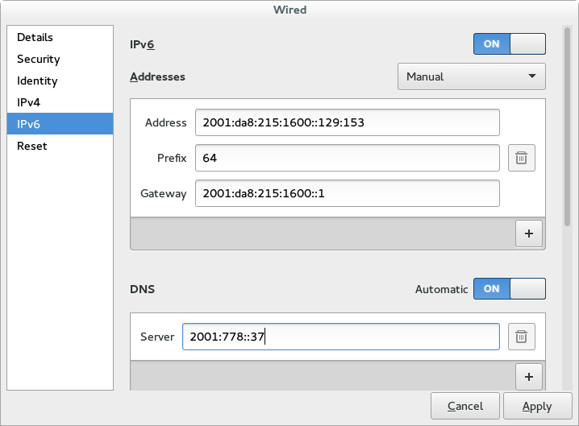
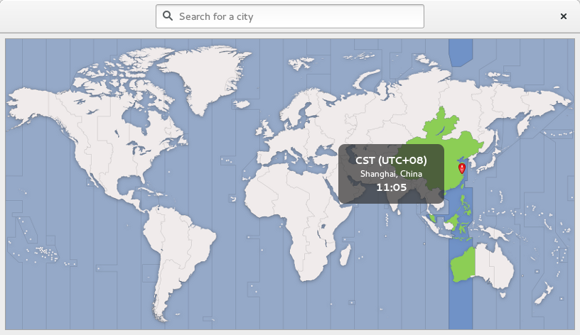
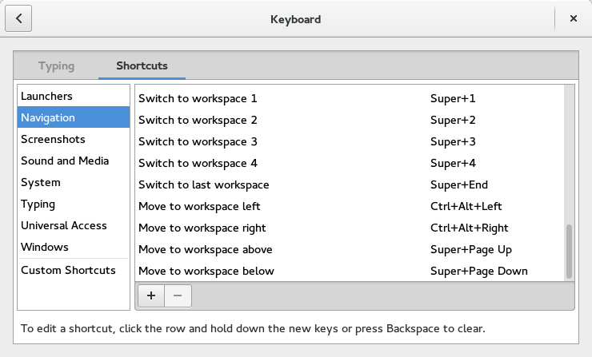
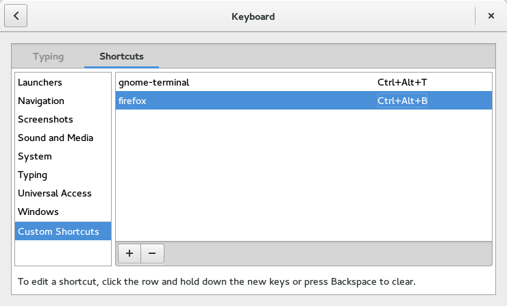
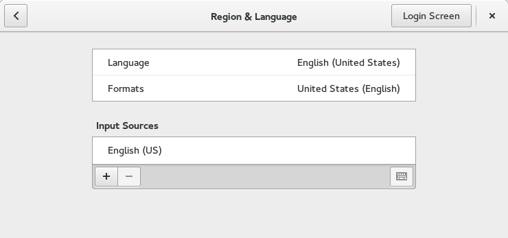
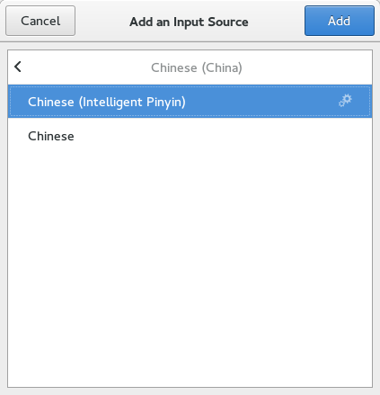

### 基本配置

(注： ``Super``指开始键)

---

#### 添加 sudo 用户

```shell
su
vi /etc/sudoers
```

在

```shell
root    ALL=(ALL)       ALL
```

下添加一行

```shell
<USERNAME>    ALL=(ALL)       ALL
```

#### IP配置

在桌面右上角下拉菜单中选中``Wired Settings``

IPv4:



IPv6:



请将上述IP替换为自己分配到的IP，其中IPv6的形式为``2001:da8:215:1600::129:*``，其中``*``为配到的IPv4的最后一位。

#### 访问集群

实验室集群需要使用 ``192.168.81.*`` 形式的IP访问，其中``*``为配到的IPv4的最后一位。

```shell
cd /etc/sysconfig/network-scripts
sudo vi ifcfg-enp0s25:1
```

(注：不同机器文件命名可能不一样，具体为该目录下的``ifcfg-***``文件后添加``:1``。继续添加IP时，命名可以为``ifcfg-***:2``、``ifcfg-***:3``等)

添加如下内容

```shell
DEVICE=enp0s25:1
NAME=enp0s25:1
ONBOOT="yes"
IPADDR=192.168.81.153
NETMASK=255.255.248.0
```

修改hosts文件

```shell
sudo vi /etc/hosts
```

添加以下内容

```shell
10.106.128.234	gitlab.local
(以下内容可以从192.168.80.5:/etc/hosts中拷贝)
192.168.80.201  namenode
192.168.80.1    datanode1
192.168.80.2    datanode2
192.168.80.3    datanode3
192.168.80.4    datanode4
...
```

#### 重启网络

```shell
sudo systemctl restart network.service
```

#### 时区配置

Super -> Setting -> Date & Time -> Time Zone



#### 快捷键配置(依据个人喜好)
Super -> Setting -> Keyboard -> Shortcuts -> Navigation



Switch to worksparce 1 设定为 Super+1

Switch to worksparce 2 设定为 Super+2

...

Super -> Setting -> Keyboard -> Shortcuts -> Custom Shortcuts
添加终端和浏览器快捷键




#### [添加中文支持](https://fedoraproject.org/wiki/I18N/Language_Support_Using_Yum)

```shell
sudo yum groupinstall simplified-chinese-support
sudo yum langinstall zh_CN 
```

#### 添加中文输入法


Super -> Setting -> Region & Language -> Input Sources -> + -> Chinese(China) -> Chinese(Intelligent Pinyin)





``Super``+``Space``来切换输入法

#### 安装常用软件

```shell
sudo yum install -y vim git maven java-1.8.0-openjdk java-1.8.0-openjdk-devel openssh openssh-server
```

#### 配置ssh

```shell
sudo systemctl start sshd.service
sudo systemctl enable sshd.service
```

#### 安装gnome-tweak-tool(可选，gnome配置图形化界面)

```shell
sudo yum install gnome-tweak-tool
gnome-tweak-tool
```

---

[返回目录](README.md)