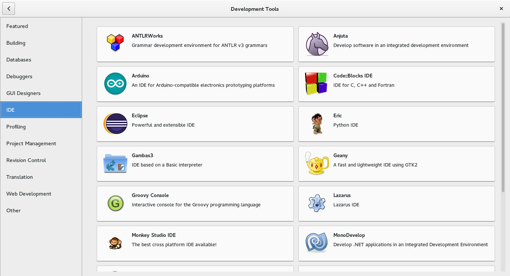

### FAQ

---

* 对硬件的支持，显卡、键盘、鼠标、有线网卡、触摸板、无线网卡等。
  
    答：一切正常（联想昭阳E47A亲测）。

* 是否支持电源管理，能自动关闭显示器关闭硬盘等，多长时间就休眠。休眠之后唤醒是否正常等。

    答：支持电源管理，Settings -> Power。

* 笔记本是否有发热很大的现象，安装Linux后比Windows的时候要热很多，风扇持续高速运转。

    答：散热正常。

* 浏览网页，接收邮件等是否正常。

    答：正常。浏览网页用Chorme、Firefox等，邮件可用Thunderbird等。

* 中文显示是否正常，中文输入法怎么解决。

    答：中文显示正常。添加中文输入法：Settings -> Region & Language -> Input Sources 。

* 开发环境是否正常，比如安装Netbeans/Eclipse，连git等。

    答：开发环境正常。如遇到中文显示乱码的情况，请参考[基本配置#添加中文支持](BaseConfig.md)。文件请使用``UTF-8``格式保存，字体请选择``Source Han Sans CN Normal``。

* 如何打开和编辑Word/Excel/PPT等Office文件。

    答：请使用``LibreOffice``，你值得拥有。

* 如何使用QQ。

    答：ChromeQQ等。

* 如何看图片、视频、听音乐。

    答：Shotwell、Videos、Rhythmbox。

* 如何外接投影仪或者显示器。

    答：直接连上即可。

---

楼主：有空的话把系统自带的软件都试一遍，基本上满足常见需求。另外，可以在``Software``里找到一大堆软件。

---

[返回目录](README.md)