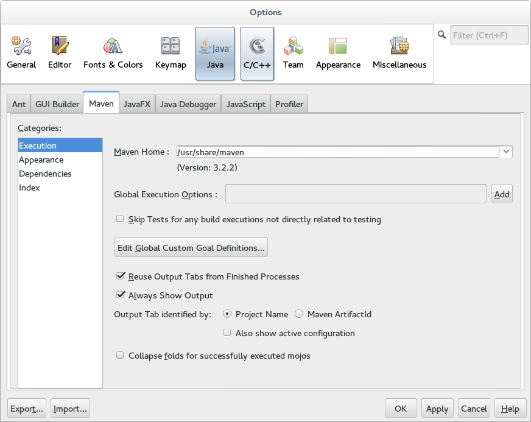
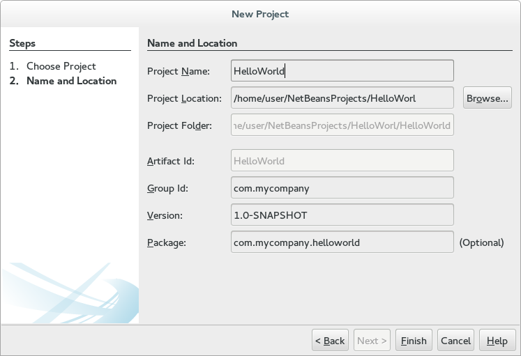
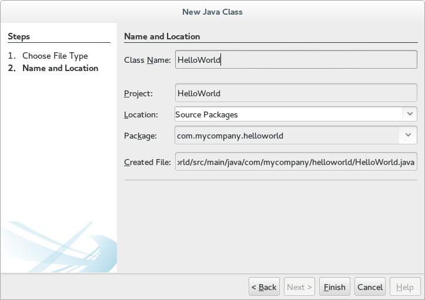
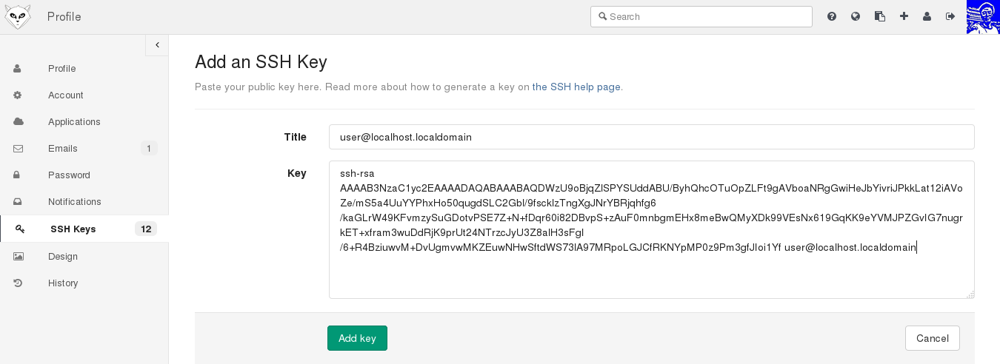
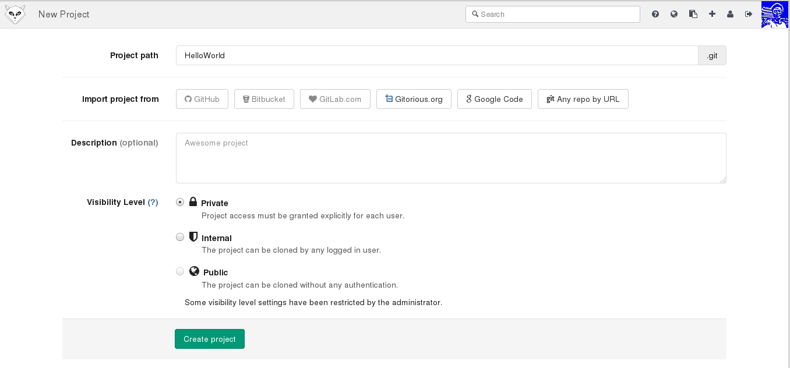

### Netbeans & Git 基本使用

---

#### 安装NetBeans IDE

```shell
sudo sh netbeans-8.0.2-linux.sh
```

按照默认配置，都点``Next``

---

#### 配置Maven

Netbeans自带Maven,但是可以指定使用自己安装的Maven

打开``Netbeans``

Tool -> Options -> Java -> Maven



将``Maven Home`` 改为``/usr/share/maven``

---

#### 创建工程

File -> New Project -> Maven -> Java Application -> Next

配置相关内容



Finish

File -> New File -> Java -> Java Class



Finish

编辑以下内容

```java
package com.mycompany.helloworld;

public class HelloWorld {

    public static void main(String[] args) {
        System.out.println("Hello world !!!");
    }
}
```

按``F6``运行程序（maven工程第一次运行需要下载较多的文件，请耐心等待）


#### 生成ssh key

```shell
ssh-keygen
```

#### 在Gitlab上添加ssh key
Profile settings -> SSH Keys -> Add SSH Key

将``～/.ssh/id_rsa.pub``内容填入页面



Add key

#### 将工程同步到Gitlab

在Gitlab上新建工程，点击``New project``



Create project

```shell
cd ~/NetBeansProjects/HelloWorld/ (工程所在目录)
git config --global user.name "池沐聪" （填自己的）
git config --global user.email "cmc@kuanguang.local"（填自己的）
git init
git add .
git commit -m "my first commit"
git remote add origin git@gitlab.local:chimucong/HelloWorld.git
git push -u origin master
```
---

[返回目录](README.md)
