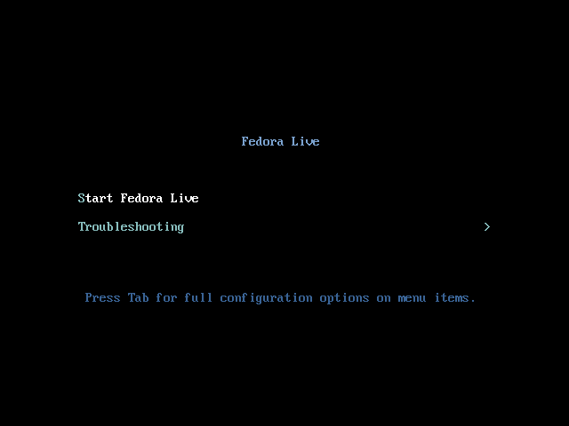
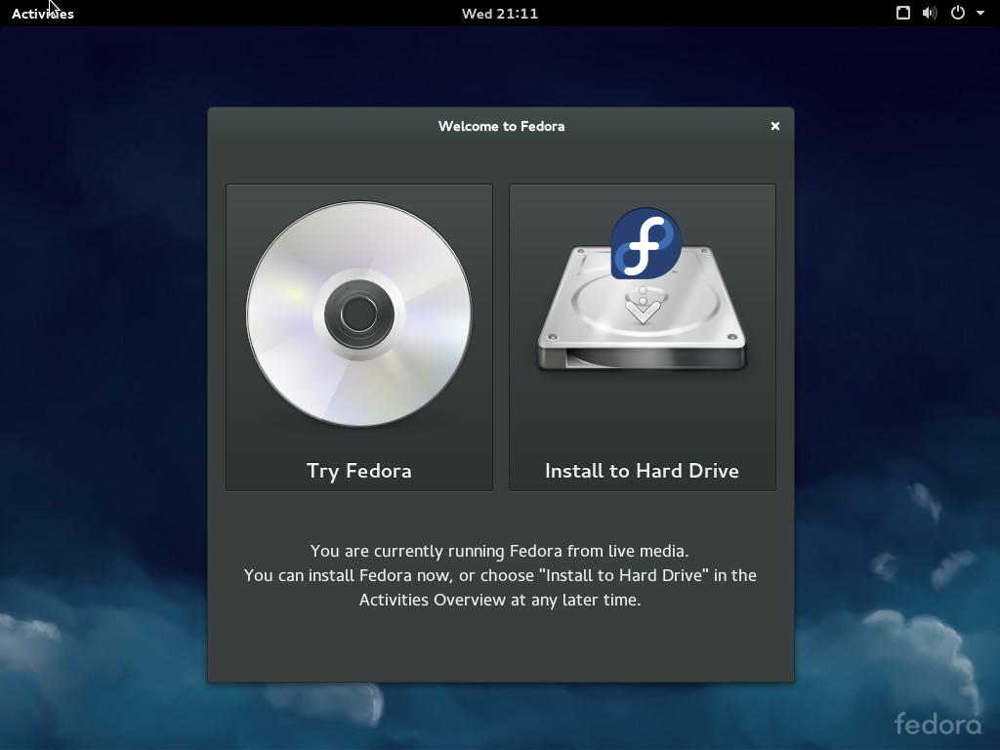
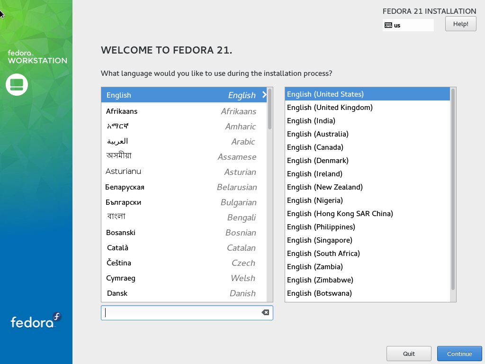
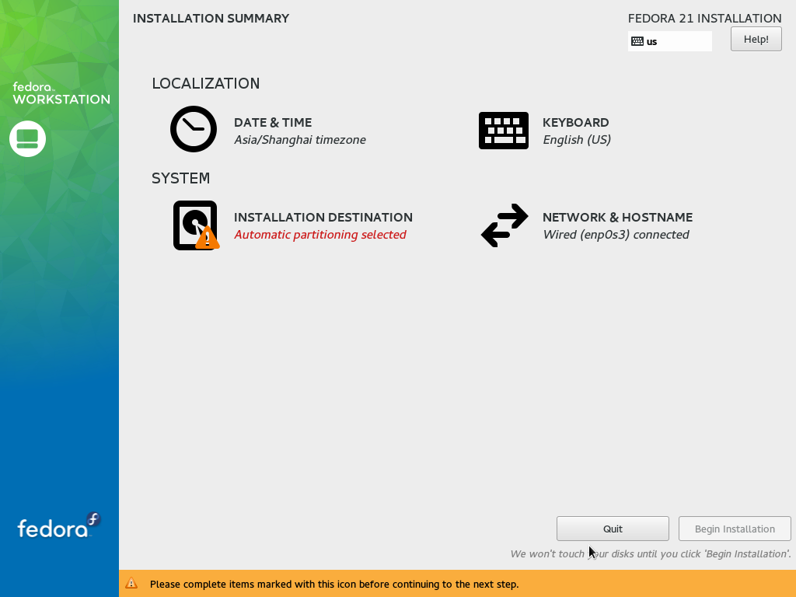
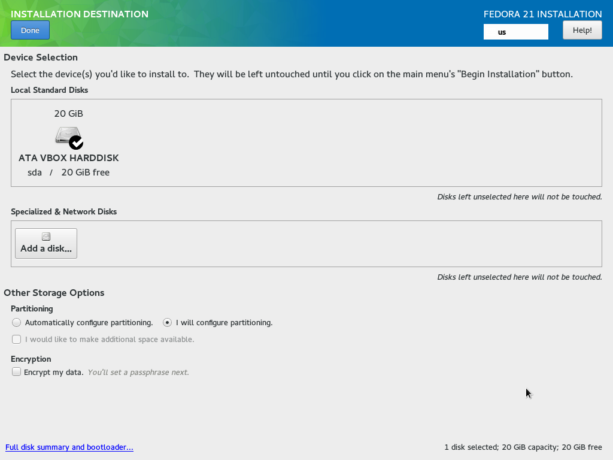
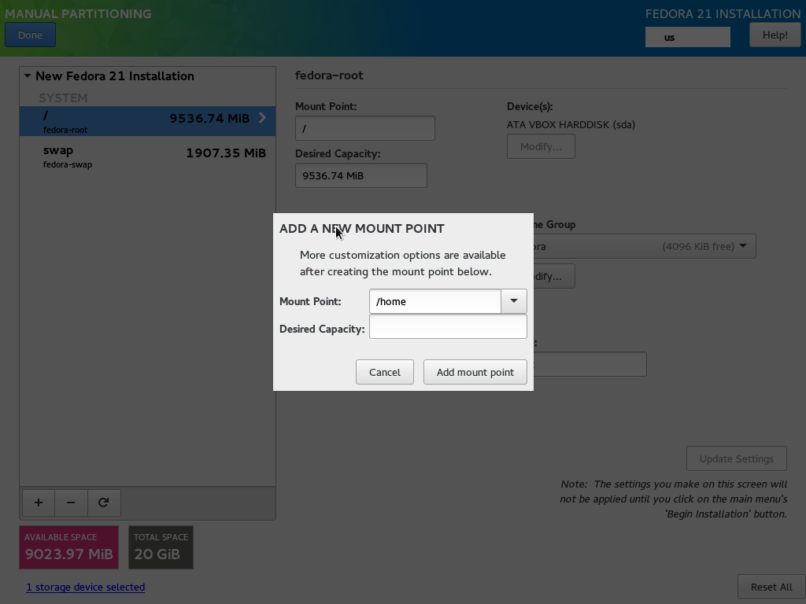
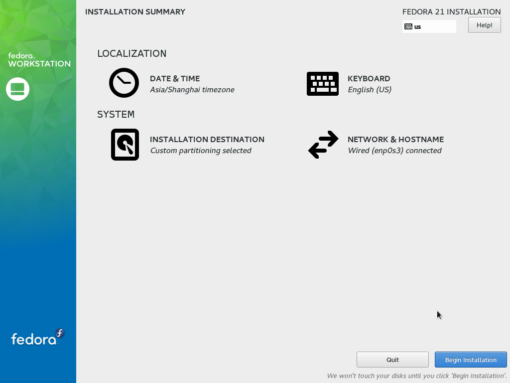
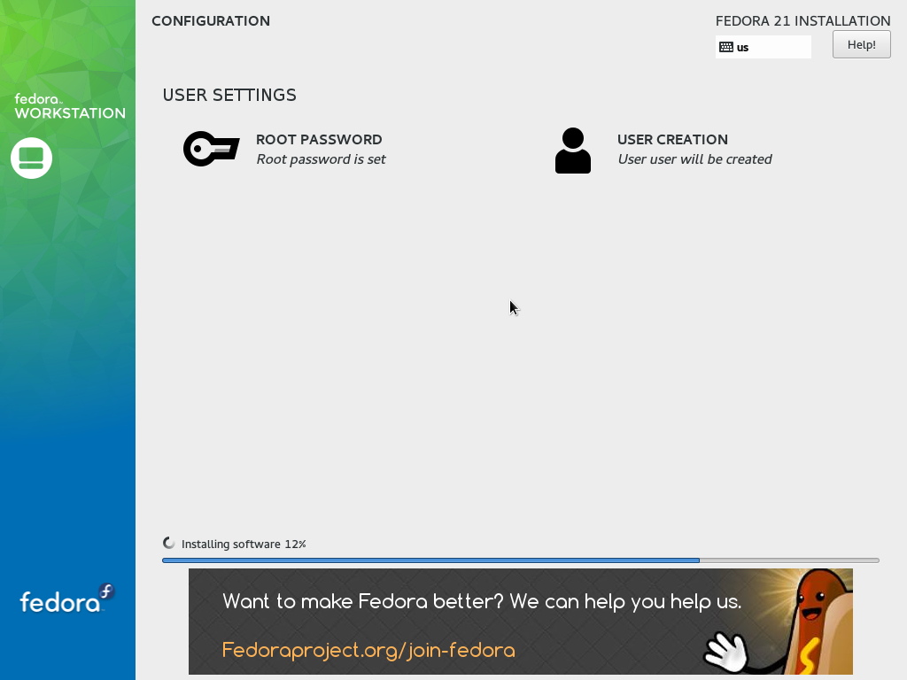

### Fedora 21 安装

---

#### 基本安装步骤

本文以安装Fedora21为例。

从[Fedora](https://getfedora.org/)网站下载Workstation版本，将镜像文件刻录到光盘或U盘上。

将安装盘接入主机，启动主机，按住F12（lenovo的主机F12为启动项选择，其他主机请参考开机启动画面的提示），选择从安装盘启动。




选择``Start Fedora Live``



选择``Install to Hard Drive``



这里选择 ``English`` 。如果选择中文的话，将会出现一些中文名称的目录，不方便使用。



点击``Installation Destination``



选中要安装到的硬盘，在``Partitioning``中选``I will configure partitioning``，点击``Done``。



点击 ``+`` ,添加挂载点，一般只需配置三个：

- swap：大小和内存容量相同（可以比内存大）
- /：100GB（视具体的使用情况决定，100GB已经够用）
- /home：剩余容量（这里推荐将/home单独分区，这样重新安装系统时个人资料可以保留）

（以上是入门配置，高级玩家请忽略）

如果不想覆盖掉原有的操作系统，只需在剩余的磁盘空间分配上述挂载点即可。启动项修复将在以下介绍。

点击``Done``



点击``Begin Installation``



配置Root和User，等待安装完毕，重启。

---

#### 修复启动项

系统安装完毕时，启动项默认只有Fedora，下面介绍如何将其他已有的操作系统添加到启动项。

启动项配置相关内容保存在 ``/boot/grub2/grub.cfg`` 中,而 ``grub2-mkconfig`` 命令会检测出所有的操作系统，并产生启动项配置文件。以``root``用户执行以下命令即可：
```shell
grub2-mkconfig -o /boot/grub2/grub.cfg
```

---

[返回目录](README.md)