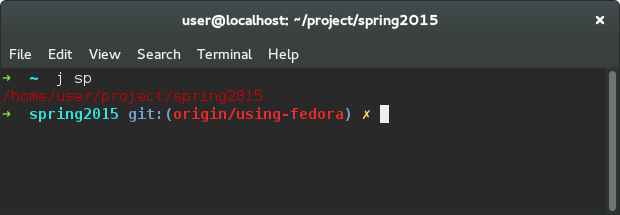
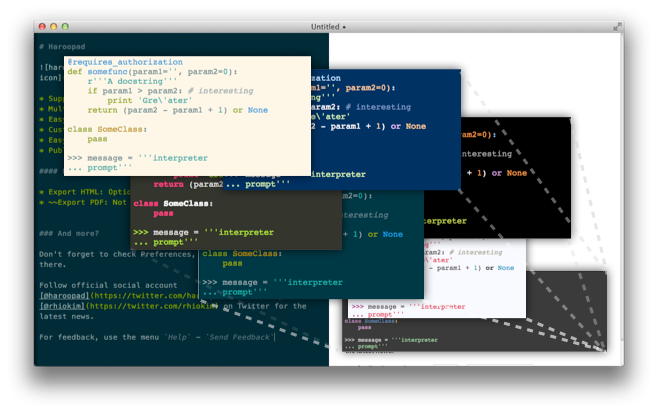

### 其他常用软件

---

#### Chrome

详见 [Install Google Chrome on Fedora 22/21, CentOS/RHEL 7.1](http://www.if-not-true-then-false.com/2010/install-google-chrome-with-yum-on-fedora-red-hat-rhel/)

---

#### Chrome QQ

在Chrome Extentions中添加QQ


点击浏览器左上角的Apps


打开QQ


---

#### Transmission

Transmission 是一个BT下载软件。

```shell
sudo yum install -y transmission
```

种子文件用 Transmission 打开即可下载，你懂的。

---

#### [oh-my-zsh](https://github.com/robbyrussell/oh-my-zsh)

zsh比系统自带的bash要智能，而且支持各种插件



上图演示了autojump和git插件。

```shell
sudo yum install zsh
sh -c "$(wget https://raw.github.com/robbyrussell/oh-my-zsh/master/tools/install.sh -O -)"
```

添加zsh插件
编辑 ~/.zshrc
修改plugins为

plugins=(git dirhistory dircycle mvn sublime sudo taskwarrior web-search autojump)

具体内容请参考插件[说明](https://github.com/robbyrussell/oh-my-zsh/wiki/Plugins)

#### autojump

```shell
sudo yum install -y autojump autojump-zsh
```

---

#### [Haroopad](http://pad.haroopress.com/)

Haroopad是一个支持Markdown的编辑器



```shell
tar zxvf haroopad-v0.13.1-x64.tar.gz
tar zxvf data.tar.gz
sudo cp -r ./usr /
tar zxvf control.tar.gz
sudo ./postinst/usr/share/icons/hicolor/128x128/apps/haroopad.png
sudo vim /usr/share/applications/Haroopad.desktop
```

将``Icon``的值替换为``/usr/share/icons/hicolor/128x128/apps/haroopad.png``

---

[返回目录](README.md)