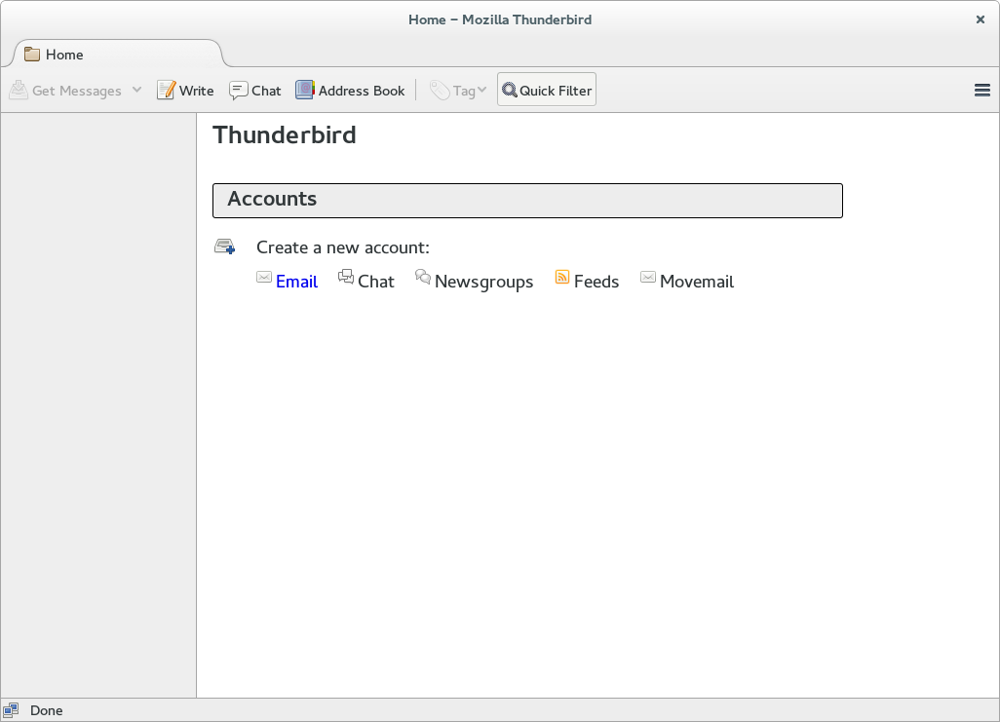

### Thunderbird

---

#### 安装Thunderbird

```shell
sudo yum install -y thunderbird
```

#### 添加账户



点击``Create a new account``下的``Email``、``Skip this and use my existing email``


``Continue``、``Manual config``


``Advanced config``


``OK``

---

#### 安装FireTray

FireTray可以使Thunderbird在后台运行。

在Thunderbird中的Add-ons菜单中搜索并安装FireTray即可。

---

[返回目录](README.md)