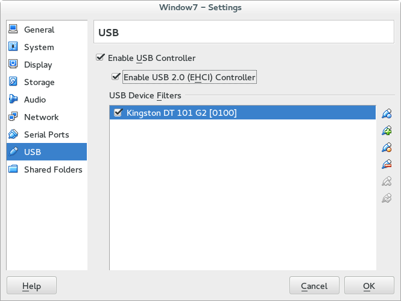

### VirtualBox

---

#### 安装VirtualBox

```shell
sudo yum install -y SDL libpng15 "kernel*" gcc gcc-c++
sudo export KERN_DIR=/usr/src/kernels/`uname -r `
sudo rpm -i VirtualBox-4.3-4.3.26_98988_fedora18-1.x86_64.rpm
sudo usermod -a -G vboxusers <USERNAME>
```

注销用户、重新登录。

---

#### 安装Extention

打开VirtualBox

File -> Preferences -> Extensions -> 右边三角按钮 -> 选中``Oracle_VM_VirtualBox_Extension_Pack-4.3.26-98988.vbox-extpack``-> Install

Machine -> New -> 输入虚拟机名字 -> Next -> Next -> ....

右击已经创建的虚拟机 -> Settings -> USB -> Enable USB 2.0 Controler -> 点击右边``+``图标 -> 选择要向虚拟机添加的设备



如上图添加了U盘。

---

#### 为虚拟机安装 Guest Additions

Guest Additions可以实现虚拟机分辨率自动适应主机等功能。

Devices -> Insert Guest Additions CD image

然后在虚拟机内安装即可。

---

[返回目录](README.md)
